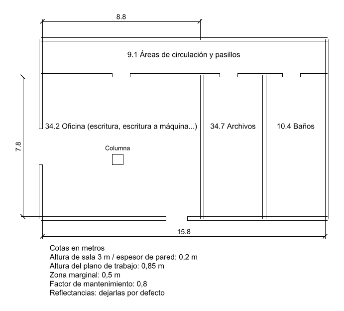
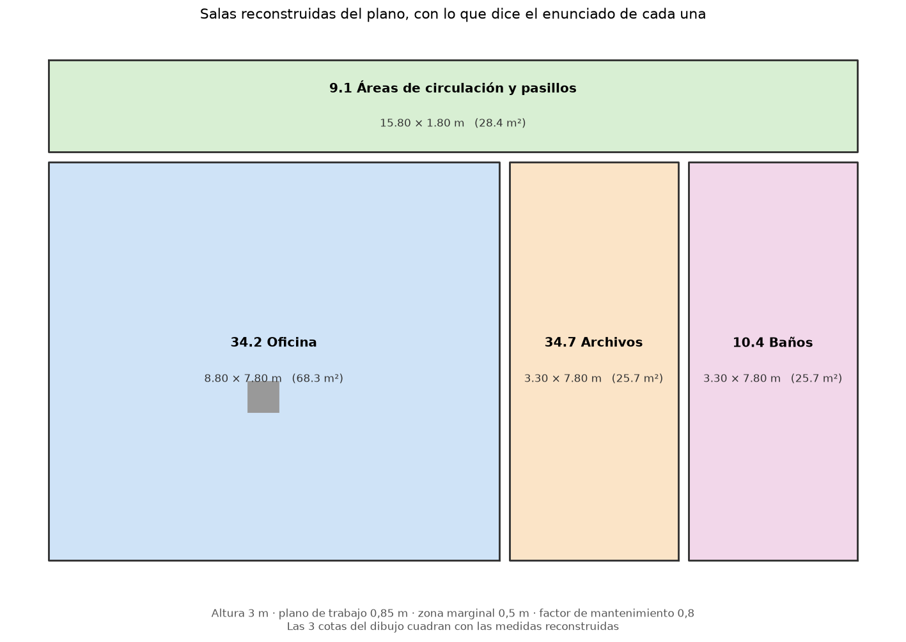
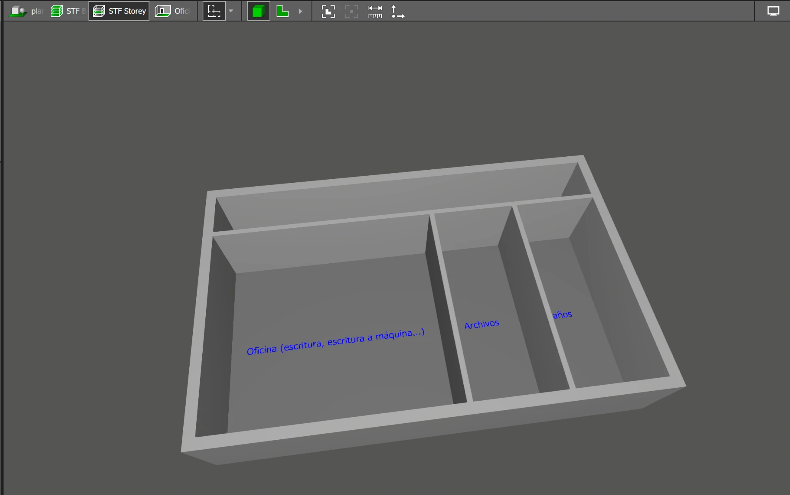

# MCP_Dialux

**Del plano de un ejercicio de iluminación al edificio construido en DIALux evo, sin dibujarlo a
mano.**

MCP_Dialux es un servidor [MCP](https://modelcontextprotocol.io) que lee el plano DWG de un
ejercicio de luminotecnia —incluido el enunciado que el profesor escribe dentro del propio
plano—, consulta lo que exige la norma UNE-EN 12464-1 para cada tipo de local y genera un fichero
que DIALux evo importa con las estancias ya levantadas.

Se usa hablando con un asistente de IA, sin tocar la línea de comandos:

> **—** Construye el edificio del examen `Examen-junio.dwg`
>
> **—** El plano no dice la altura de las salas. ¿Qué altura tienen?
>
> **—** 3 metros
>
> **—** Listo: 7 salas en 2 plantas, en `salida/Examen-junio.stf`. Las 6 cotas del plano cuadran
> con las medidas reconstruidas. En Archivos hay una columna de 0,66 × 0,63 m en (22,18 ; 6,65)
> que tendrás que poner a mano.



*El punto de partida: muros dibujados como líneas sueltas, el enunciado escrito dentro del dibujo
y el uso de cada zona con su referencia de la norma.*



*Lo que la herramienta entiende, y que es lo que acaba en DIALux. Las cotas del dibujo sirven de
comprobación: si no cuadran con las salas reconstruidas, avisa.*



*El resultado: el mismo plano ya levantado en DIALux evo, con sus paredes y su altura, listo para
calcular.*

---

## Por qué existe

En clase de iluminación el ejercicio siempre empieza igual: un plano en DWG, un enunciado con los
datos del local y un catálogo de luminarias. Después hay que montarlo en DIALux evo, que es el
programa estándar del sector, y calcular.

Montar el edificio es la parte lenta y la que no enseña nada: dibujar paredes siguiendo un plano
que ya existe. Este proyecto la automatiza, para poder dedicar el tiempo al cálculo y, sobre todo,
para **comparar el edificio generado con el que uno ha hecho a mano** y detectar dónde se ha
equivocado.

## Qué hace

| Herramienta | Entrada | Salida |
|---|---|---|
| `leer_plano` | Un `.dwg` o `.dxf` | Plantas, salas, contornos, superficies, columnas y los datos del enunciado escritos en el plano, comprobados contra las cotas del dibujo |
| `construir_edificio` | Un `.dwg` o `.dxf` | Un fichero `.stf` que DIALux evo importa con las estancias levantadas, sus puertas y ventanas, las luminarias repartidas en retícula si se dice cuántas, más la lista de lo que hay que rematar a mano |
| `reticula_luminarias` | Medidas de una sala y cuántas luminarias | Cómo queda el reparto: filas × columnas, separación, distancia al muro y la posición de cada una |
| `requisitos_norma` | Una referencia de tabla, `"34.7"` | Ēm, U₀, Ra, UGR e iluminancias en paredes y techo, citando tabla, fila y página del PDF de la norma |
| `buscar_en_norma` | Un texto, `"enfermería"` | Las filas de la norma que encajan, para encontrar la referencia cuando el enunciado no la da |
| `leer_proyecto` | Un `.stf` o el `.dwg` que exporta DIALux | Qué edificio contiene: salas, plantas, medidas, alturas, muebles, luminarias y los resultados de DIALux si los trae, sin abrir el programa |
| `comparar_edificios` | Dos edificios, cada uno `.stf` o `.dwg` exportado de DIALux | En qué se diferencian, sala por sala, **luminarias incluidas**: cuántas hay en cada uno y cuántas están en el mismo sitio |
| `corregir_trabajo` | El `.dwg` de un proyecto ya calculado y la fila de la norma de cada sala | Qué cumple y qué no: Ēm y U₀ medidos contra los exigidos, citando tabla, fila y página |

### Un ejemplo real

El examen final de junio es un edificio de dos plantas con nueve zonas. De su plano salen, sin
escribir un dato a mano:

- **Las salas**, reconstruidas a partir de muros dibujados como líneas sueltas: oficina en L de
  214 m², archivos, sala de atención médica, baños, pasillo y dos huecos de ascensor.
- **Los datos de cada zona**, que la profesora escribe como texto dentro del plano: altura del
  plano de trabajo, zona marginal, factor de mantenimiento y el tipo de actividad según la norma
  (`34.2 Oficina`, `10.7 Sala para atención médica`…).
- **Las columnas** que hay dentro de dos salas, con su tamaño y su posición.
- **Las puertas y las ventanas**, deducidas de los huecos que quedan en los muros: en fachada un
  hueco ancho es una ventana y uno estrecho la entrada; hacia dentro, un paso entre salas.
- **La comprobación**: las 6 cotas del dibujo coinciden con las medidas reconstruidas.

## Cómo funciona

```
 .dwg  ──ODA File Converter──►  .dxf  ──ezdxf──►  geometría + textos
                                                        │
          ┌─────────────────────────────────────────────┤
          ▼                                             ▼
   reconstruir salas                            leer el enunciado
   (shapely)                                    (altura, plano de
          │                                      trabajo, actividad)
          └─────────────────┬───────────────────────────┘
                            ▼
                   comprobar con las cotas
                            │
                            ▼
                    escribir el .stf ──────►  DIALux evo
```

Tres problemas interesantes por el camino:

**1. En el plano no hay ninguna sala.** Los muros son polilíneas abiertas, con la cara interior y
la exterior por separado y huecos en las puertas; las capas no distinguen un muro de una cota. Las
salas se reconstruyen cerrando los huecos entre tramos alineados, poligonizando el dibujo y
quedándose con las caras cuya anchura media supera el grosor de un muro. Un detalle que costó
encontrar: DIALux importa mal una pared que toca a dos salas si no hay un vértice justo donde
acaba la pared del vecino, así que las paredes se parten automáticamente en esos puntos.

**2. El enunciado va dentro del plano, como texto suelto.** Cada texto se asigna a la sala que lo
contiene, y los párrafos que quedan fuera del dibujo se agrupan y se asignan por su encabezado
("Sobre los baños"). Lo que no se reconoce con seguridad no se interpreta: se devuelve tal cual
para que lo lea el asistente.

**3. La norma es un PDF de 114 páginas.** Las tablas de la UNE-EN 12464-1:2022 se leen localizando
las columnas por su cabecera en cada tabla, porque cambian de posición incluso dentro de la misma
página. De 319 filas se leen 314; las 5 restantes son títulos de grupo o filas con casillas vacías
en la propia norma, y se devuelven como "consúltala en el PDF" en vez de rellenarlas. Contrastadas
con una lectura independiente, **coinciden las 303 filas comparables**.

## Ingeniería inversa del formato STF

DIALux evo importa arquitectura en tres formatos: IFC (solo en la versión de pago), DX4 (del
DIALux clásico) y **STF**. STF es el único camino gratuito, y su especificación **no es pública**:
DIAL la envía por correo a quien la pide.

El generador de este proyecto se escribió deduciendo el formato de dos exportadores de código
abierto —[STF-Exporter](https://github.com/kmorin/STF-Exporter) para Revit y
[DIALux_Toolkit](https://github.com/BHoM/DIALux_Toolkit) de BHoM— y validando cada campo
importando ficheros de prueba en DIALux evo 14. Después, el soporte de DIAL envió la
especificación oficial a quien la pidió, que confirmó los hallazgos y corrigió un campo deducido
mal. El documento es confidencial y no se incluye aquí.

Lo que se averiguó probando, antes de tener el documento:

| Comprobación | Resultado |
|---|---|
| Contorno, nombre, altura y plano de trabajo | Se importan bien, incluidas las plantas en forma de L |
| Pared que toca a dos salas sin vértice en la unión | La sala entra cruzada por una diagonal. Se corrige partiendo la pared |
| Importar un segundo STF en el mismo proyecto | **Sustituye** el proyecto, no añade. Todo tiene que ir en un fichero |
| Dos salas en el mismo sitio (dos plantas superpuestas) | Se pierden: solo sobrevive una |
| Nivel o planta de cada sala | No se ha encontrado. Probados 16 nombres de campo, los puntos del contorno con tercera coordenada y una sección de planta aparte: todas las salas salen al nivel del suelo. La especificación lo confirmó después: una sala es un polígono 2D, el formato no tiene plantas |
| Columnas | Entran como mueble: DIALux evo importa los muebles como cajas, que es lo que necesita una columna |
| Ventanas y puertas | El formato las admite, pero DIALux evo no las importa (sí DIALux 4). Se escriben igualmente y se devuelven con sus medidas para ponerlas a mano |
| Zona marginal | El formato no la tiene |

Como el formato no sabe de plantas, las de un mismo edificio se escriben separadas en el plano,
con un desplazamiento redondo que la herramienta indica, y cada sala lleva su planta en el nombre
(`Archivos [segunda]`) para poder repartirlas dentro de DIALux.

## Comparar con el proyecto hecho a mano

DIALux evo no exporta STF, pero sí exporta el plano a DWG. Ese DWG viene en capas
(`DLX_CALC` con la superficie de cálculo de cada sala, `DLX_DESC` con los nombres, `DLX_CONT` con
los muros en 3D y `DLX_OBJ` con los objetos), así que se puede leer y contrastar sala por sala con
el edificio generado: medidas, superficies, alturas, plano de trabajo y columnas.

Es lo que cierra el círculo del proyecto: montar el ejercicio a mano, exportarlo y ver en qué se
diferencia del que sale del plano. Lo que el DWG no trae —factor de mantenimiento, luminarias,
puertas y ventanas— se informa aparte en vez de contarlo como diferencia.

## Decisiones de diseño

- **Nunca inventar un dato.** Si el plano no dice la altura de las salas, no se escribe ningún
  fichero: se devuelve qué falta y para qué salas. Un edificio con una altura inventada parece
  correcto, y eso es peor que no tener nada.
- **Los valores de la norma salen del PDF del usuario**, no están copiados en el código, y cada
  respuesta dice de qué tabla, fila y página viene para poder comprobarla en el papel.
- **Lo que la herramienta no puede hacer, lo dice con números.** Las columnas y la zona marginal
  no caben en el STF, así que se devuelven con su valor y su posición ya calculados, para no tener
  que volver al plano.
- **Cada regla del código tiene al lado la medición que la justifica**, con la fecha en la que se
  comprobó.

## Con qué muros se choca DIALux evo

Casi todo el trabajo manual que queda no es del programa que hay aquí, sino de lo que el
ecosistema de DIALux evo deja o no deja hacer. Cada línea está comprobada importando ficheros en
evo 14, y las tres primeras confirmadas además por el soporte de DIAL:

| Lo que no se puede | Consecuencia |
|---|---|
| **El formato STF no guarda el nivel de una sala**: una sala es un polígono 2D con suelo y techo planos | Las plantas de un edificio se separan en el plano y se colocan a mano en DIALux. Se probaron 16 nombres de campo, la tercera coordenada en los puntos y una sección de planta aparte; la especificación oficial lo confirmó después |
| **Importar un segundo STF sustituye el proyecto**, no añade | Todo el edificio tiene que ir en un solo fichero |
| **Dos salas en el mismo sitio se pierden**: solo sobrevive una | Las plantas no pueden escribirse superpuestas |
| **evo no importa ventanas ni puertas** del STF, aunque el formato las lleve (DIALux 4 sí) | Se escriben igualmente, y además se devuelven con su posición y tamaño para ponerlas a mano |
| **evo sí importa los muebles**, como cajas (DIALux 4 no) | Las columnas entran solas |
| **El formato no tiene zona marginal** | Se devuelve el valor del enunciado para teclearlo en la superficie de cálculo |
| **Los nombres del edificio y de la planta los pone DIALux** ("STF Building", "STF Storey") | Se renombran con doble clic. El nombre del proyecto y los de las salas sí salen del fichero |
| **IFC es de pago**, tanto al importar como al exportar | STF es el único camino gratuito |
| **evo no exporta STF** | Para comparar un proyecto hecho a mano se usa su exportación a DWG |
| **La exportación a DWG tiene dos variantes y ninguna lo trae todo**: la 3D lleva alturas pero no luminarias ni plantas; la 2D lleva plantas, luminarias y los resultados, pero está toda a z = 0 | Se leen las dos y cada una dice en 'avisos' lo que no puede dar. Para comparar alturas, la 3D; para corregir, la 2D |
| **evo no lee del STF la luminaria, solo su posición** (lo dice la propia especificación) | Las luminarias llegan colocadas pero como marcadores: la real se elige dentro de DIALux |

Dos rarezas de esa exportación a DWG, por si alguien la lee: el fichero **declara pulgadas**
aunque se exporte en metros, y la envolvente exterior sale **con el forjado incluido**, midiendo
3,2 m donde la sala mide 3. Las dos están resueltas en el código.

## Corregir un trabajo, que es para lo que existe

Lo de arriba construye; esto comprueba. DIALux evo no exporta STF, pero **sí exporta el proyecto a
DWG**, y dentro de ese DWG van sus propias tablas de resultados. De ahí sale la corrección: no hay
ningún cálculo propio, son los números de DIALux contra los de la norma.

Con un trabajo de clase real —un edificio de tres plantas con 15 locales, de los que uno estaba
calculado— la herramienta devuelve esto del aula:

| | Medido por DIALux | Exigido (fila 44.1, Aula – Actividades generales) |
|---|---|---|
| Ēm | 596 lx | 500 lx requerido / 1000 lx modificado |
| U₀ | 0,53 | 0,60 |
| Potencia específica | 7,67 W/m² | — |

O sea: la iluminancia sobra y **la uniformidad no llega**, que es exactamente el tipo de fallo que
uno no ve mirando el render. Los dos Ēm se dan sin elegir: la norma da el requerido y el
modificado, y cuál piden en clase lo decide el alumno.

Lo que **no** se puede corregir así, y la herramienta lo dice en cada sala para que nadie crea que
el trabajo está entero revisado: Ra, RUGL (deslumbramiento) y las iluminancias de paredes, techo y
zona circundante. DIALux las calcula, pero no las escribe en las tablas del DWG.

De paso, de los propios resultados se despeja el rendimiento del local (Ēm = n·Φ·FM·η/S → η =
0,83 en ese aula). No es un dato de catálogo, pero sirve para comprobar el orden de magnitud de un
cálculo por el método de los lúmenes mientras no haya fotometría.

## Limitaciones del proyecto

- Las luminarias **se colocan pero no se cuentan**: hay que decirle cuántas van en cada sala y las
  reparte en retícula, con la separación y la distancia al muro calculadas. Cuántas hacen falta es
  el cálculo luminotécnico, y para eso hace falta la fotometría de la luminaria (`.ldt` o `.ies`),
  que no viene en las fichas PDF del catálogo. Es el siguiente paso.
- Las luminarias entran en DIALux **como marcadores, sin fotometría**: la especificación de STF
  dice que DIALux escribe los datos de la luminaria pero los ignora al importar, así que hay que
  sustituirlas por la luminaria real del ejercicio. Están en su sitio, que es lo laborioso.
- Probado con planos de AutoCAD 2023 y 2024 en metros; otros orígenes pueden necesitar ajustes.
- La lectura de un plano se apoya en convenciones de dibujo (muros de doble línea, huecos en las
  puertas, el enunciado como texto): con un plano muy distinto habría que medir de nuevo los
  umbrales de `geometria.py`.

## Probarlo sin tener un plano

El repositorio trae un plano de ejemplo, `ejemplos/plano-ejemplo.dxf`, con el mismo estilo que los
de clase: muros de doble línea, huecos de puerta, una columna, el enunciado escrito dentro y las
cotas. Es el de las imágenes de arriba, y se puede regenerar con
`python ejemplos/generar_plano_ejemplo.py`.

Basta con pedirle al asistente:

> Construye el edificio de `ejemplos/plano-ejemplo.dxf`

## Instalación

Requisitos:

- Python 3.12 o superior
- [ODA File Converter](https://www.opendesign.com/guestfiles/oda_file_converter), gratuito, para
  leer DWG (`ezdxf` solo lee DXF)
- DIALux evo (Windows) para importar el resultado
- Tu copia del PDF de la UNE-EN 12464-1 en `material/norma/`, si quieres las herramientas de norma

```bash
python3 -m venv .venv
.venv/bin/pip install -r requirements.txt
.venv/bin/python -m pytest -q pruebas
```

En Windows:

```powershell
py -m venv $HOME\.venvs\mcp_dialux
~\.venvs\mcp_dialux\Scripts\pip install -r requirements.txt
~\.venvs\mcp_dialux\Scripts\python -m pytest -q pruebas
```

## Conectar con un cliente MCP

En Claude Desktop: *Ajustes → Desarrollador → Editar configuración*, y añadir el servidor a
`claude_desktop_config.json`. Después, cerrar la aplicación del todo y volver a abrirla.

```json
{
  "mcpServers": {
    "dialux": {
      "command": "/ruta/al/proyecto/.venv/bin/python",
      "args": ["/ruta/al/proyecto/server.py"]
    }
  }
}
```

En Windows, las rutas van con doble barra: `"C:\\Users\\tu-usuario\\.venvs\\mcp_dialux\\Scripts\\python.exe"`.

Si ODA File Converter no está en su carpeta habitual, se le indica con
`"env": {"ODA_FILE_CONVERTER": "ruta al ejecutable"}`.

## Estructura

```
server.py              el servidor MCP: solo declara las herramientas
dialux/
  cad/convertir.py     DWG → DXF con ODA, igual en macOS y en Windows, con caché por hash
  cad/geometria.py     reconstruir las salas del plano
  cad/enunciado.py     leer los datos del ejercicio de los textos del plano
  cad/plano.py         leer_plano: lo junta y lo comprueba contra las cotas
  norma.py             las tablas de la UNE-EN 12464-1, leídas del PDF
  leer_stf.py          leer un STF y comparar dos edificios
  luminarias.py        repartir las luminarias de una sala en retícula
  corregir.py          contrastar los resultados de un trabajo con la norma
  export_dialux.py     leer el DWG que exporta DIALux evo, para comparar con lo hecho a mano
  stf.py               escribir el fichero que importa DIALux evo
  construir.py         del plano al edificio
ejemplos/              un plano de ejemplo para probar la herramienta sin material de clase
docs/imagenes/         las imágenes de este README
pruebas/               40 pruebas, sobre el plano de ejemplo y sobre planos de examen reales
```

Los planos de clase, el PDF de la norma y las fichas de luminarias **no se incluyen** en el
repositorio: son material de la asignatura.

## Pruebas

```bash
.venv/bin/python -m pytest -q pruebas
```

Las pruebas se apoyan en los exámenes reales y se saltan solas si no están. Cada una documenta el
fallo que la hizo necesaria: la diagonal del pasillo, los textos de dos salas que se asignaron al
revés, las filas de la norma con los miles escritos sin espacio.

## Licencia

MIT. Ver [LICENSE](LICENSE).
